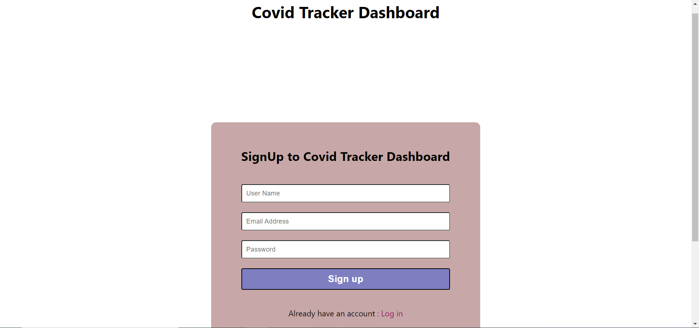
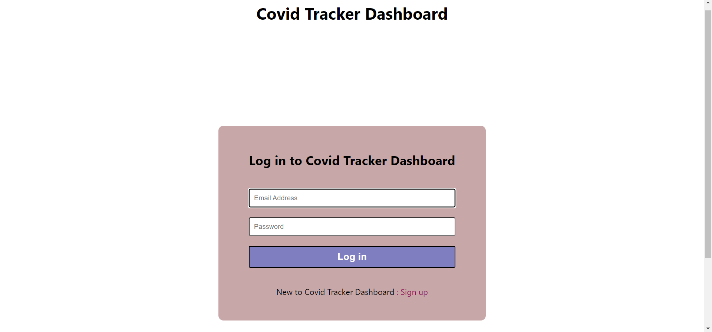
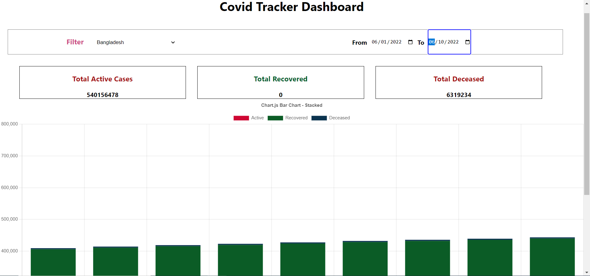

# Covid Tracker Dashboard

Through this app user can signup and sign in for access the Covid-tracker app and track the Covid cases globally or country wise through graph representation.

# Tech Stack Used 💻

- ReactJS
- React-hooks
- css3
- JavaScript

## How to run the project 🚀

Please fork the repository and then use it on your own.

You can also take a glimpse of our Project, just follow the below steps:

1. Run the command npm run start in terminal to start the app at port 3000.

2. Go to the browser you will land on the home page.

## Snapshots 📷

1. Signup page

2. Login page

3. Home Page

## Features ✨
- I have added Login and signup pages in the app.
- User can track Covid cases globally or country wise.

## Demo 🎥

Deployed Link: [Covid Tracker](https://covid-tracker-mfjeayt97-sumitra05.vercel.app/)

## Team Members and Contributors 😇

👤 Solo Project
- Duration 2 days
- Github : [Sumitra Awadhiya](https://github.com/sumitra05)
